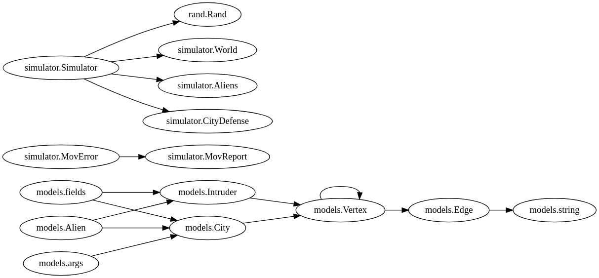
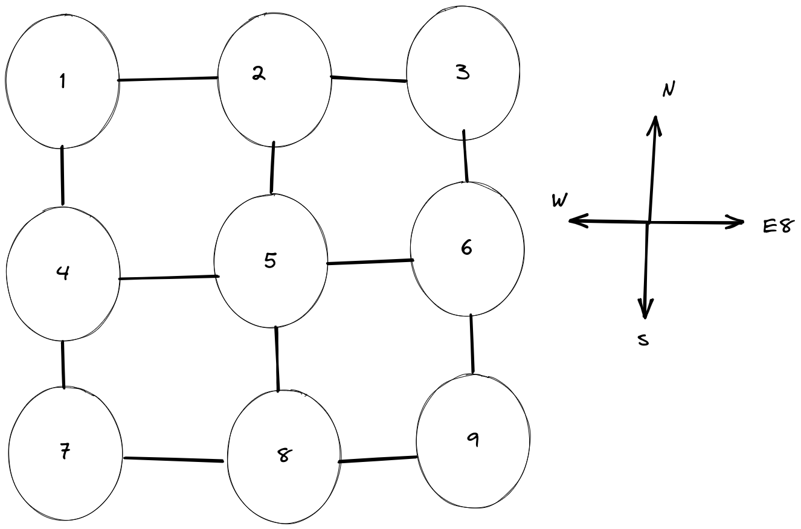
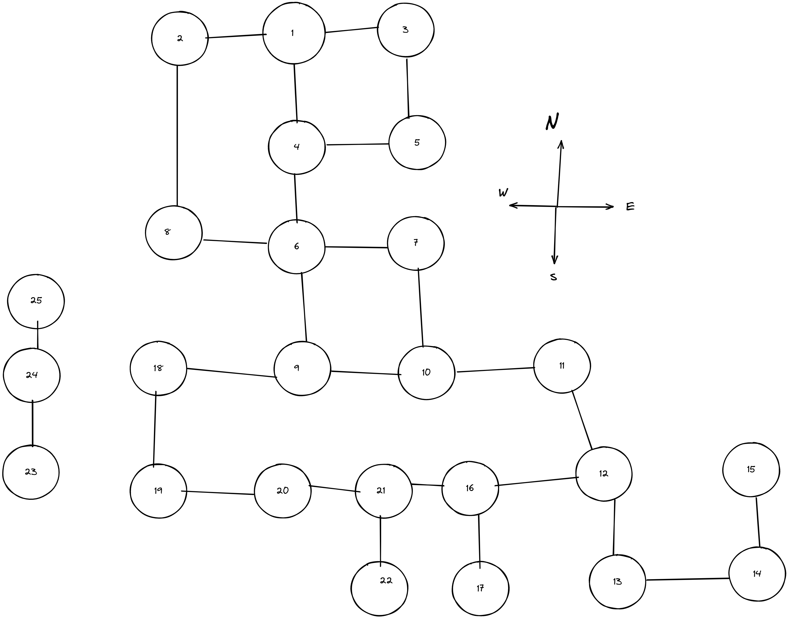

# Alien Invasion Case Study

# Requirements and Explanations for Task
<details>
  <summary>Mad aliens are about to invade the earth and you are tasked with simulating the
invasion.
You are given a map containing the names of cities in the non-existent world of
X. The map is in a file, with one city per line. The city name is first,
followed by 1-4 directions (north, south, east, or west). Each one represents a
road to another city that lies in that direction.</summary>
  
For example:
Foo north=Bar west=Baz south=Qu-ux
Bar south=Foo west=Bee
The city and each of the pairs are separated by a single space, and the
directions are separated from their respective cities with an equals (=) sign.
You should create N aliens, where N is specified as a command-line argument.
These aliens start out at random places on the map, and wander around randomly,
following links. Each iteration, the aliens can travel in any of the directions
leading out of a city. In our example above, an alien that starts at Foo can go
north to Bar, west to Baz, or south to Qu-ux.
When two aliens end up in the same place, they fight, and in the process kill
each other and destroy the city. When a city is destroyed, it is removed from
the map, and so are any roads that lead into or out of it.
In our example above, if Bar were destroyed the map would now be something
like:
Foo west=Baz south=Qu-ux
Once a city is destroyed, aliens can no longer travel to or through it. This
may lead to aliens getting "trapped".
You should create a program that reads in the world map, creates N aliens, and
unleashes them. The program should run until all the aliens have been
destroyed, or each alien has moved at least 10,000 times. When two aliens
fight, print out a message like:
Bar has been destroyed by alien 10 and alien 34!
(If you want to give them names, you may, but it is not required.) Once the
program has finished, it should print out whatever is left of the world in the
same format as the input file.
Feel free to make assumptions (for example, that the city names will never
contain numeric characters), but please add comments or assertions describing
the assumptions you are making.
</details>

# Desing of Solution


* [simulator.Simulator](simulator/simulator.go) is where magic happens contains all required data structs to operate simulation
```go

type Simulator struct {
	// Simulator config
	R            *rand.Rand
	Iteration    int
	EndIteration int
	// World state
	World
	Aliens
	CityDefense
}
  ```
* [simulator.MovError](simulator/movemontreporter.go) is data structure for collecting sim errors with detailed and more pretty
```go
type MovReport uint8

type MovError struct {
	reason MovReport
}

const (
	// MovAlienDead when Alien is Dead
	MovAlienDead MovReport = iota
	// MovAlienTrapped when Alien is Trapped
	MovAlienTrapped
	// MovWorldDestroyed when World is destroyed
	MovWorldDestroyed
	// MovMessage when no-op
	MovMessage = " cant move needs to invastigate %s\n"
)

```
* [Models](models/)
  Shows model class

  1. [Edge](models/edge.go)
 ```go
//Edge type
type Edge struct {
	Key     string
	Vertexs []string
}
```
  2. [Vertex](models/vertex.go)
```go
type Vertex struct {
	Name          string
	SimConditions map[string]bool
	Edges         []*Edge
	Vertexs       map[string]*Vertex
}

```
  3. [Intruder](models/intruder.go)
```go
type Intruder struct {
	Name          string
	SimConditions map[string]bool
	Vertex        *Vertex
}

```
This is base struct types for city, alien and generated world map.

* [Sim Models](simulator/)
  Shows Sim Models
  
  1. [Alien](simulator/models/alien.go)
```go
type Alien struct {
	models.Intruder
	city *City
}
```
  2. [City](simulator/models/city.go)
```go
type City struct {
	models.Vertex
	RoadNames map[string]string
}
```
  3. [World](simulator/models/world.go)
```go
type World map[string]*City
```

This is more specified for simulation.
### File Structure
```
.
├── banner
│   ├── banner.go // banner string and helper functions for printing banner
│   └── banner_test.go // test file of banners
├── cmd
│   ├── cmdConfig.go // Contains config parameters like Movement count of alien and number of aliens etc.
│   ├── cmdFlagParser.go // Parse flags from commandline and check for errors
│   └── cmd.go // main file for sim start
├── files
│   ├── aliensNames.txt // contains random names with GenerateAlienNamesAndWriteToFile function in utils
│   ├── aliensNew.txt // If alien count is greater than 1000 we can generate new alien names
│   ├── example.txt // example world map for simulator can run
│   └── testcase1.txt //same file but used for testing purpose
├── go.mod
├── go.sum
├── imgs
│   ├── example.png
│   ├── graphviz.png
│   └── test1.png
├── LICENSE
├── main.go
├── models
│   ├── edge.go // Base struct for connection in graph 
│   ├── intruder.go // Base struct for Alien that contains invading behavior
│   └── vertex.go // Base struct for graph node
├── README.md
├── simulator
│   ├── builder.go // Contains a lot of important functions like ReadWorldMapFile and IdentifyAliens
│   ├── models
│   │   ├── alien.go  //Alien Model
│   │   ├── alien_test.go
│   │   ├── city.go  // City Model
│   │   ├── city_test.go
│   │   ├── simConditionsFlags.go // SimConditions for determini dead aliens and destroyed cities
│   │   └── world.go // World Model
│   ├── movemontreporter.go
│   └── simulator.go
└── utils
    ├── generateRandomNames.go
    ├── generateRandomNames_test.go
    ├── logLevelSetter.go
    ├── logLevelSetter_test.go
    ├── printPretty.go
    ├── slices.go
    └── slices_test.go

8 directories, 36 files
```
### Example World Map For Alien Invasion



#### This one is simple fully connected graph used for PoC.



#### This one has contains all test cases for the world map

### Documentation

```
go get -v  golang.org/x/tools/cmd/godoc

godoc -http=:6060

# http://localhost:6060/pkg/sagaAlienInvasion/
```
[Localhost Documentation Link](http://localhost:6060/pkg/sagaAlienInvasion/)

### Debug Configuration

You can reach Debug configuration in [here](.vscode/launch.json). 